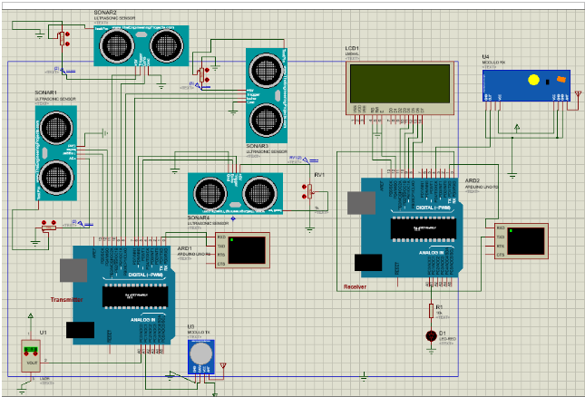
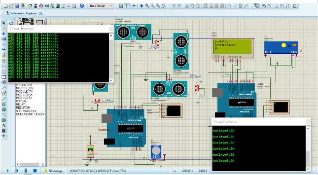

Remote monitoring of patients using arduino
Uses rf modules to communicate and ultrasonic sensors ,temperature sensors etc. to monitor the patient

## Screenshots

### Circuit Diagram

### Simulation

